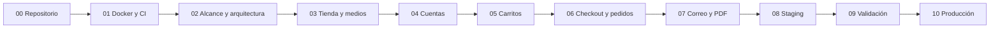

# Roadmap

Este documento conserva el alcance, el estado y los hitos principales del proyecto. Las instrucciones reproducibles viven en las guías enlazadas; los resultados de cada recorrido y los incidentes puntuales no se registran aquí.

El alcance aprobado está en [MVP_SCOPE.md](MVP_SCOPE.md), las decisiones transversales en [AGENTS.md](../AGENTS.md) y el comportamiento de cada módulo en sus contratos de `docs/contracts/`.

| Fase | Resultado | Estado |
|---|---|---|
| 00 · Repositorio | GitHub y base documental | Completada |
| 01 · Entorno local y Docker | Stack local reproducible y CI básico | Completada |
| 02 · Alcance y arquitectura | Alcance MVP y contratos transversales | Completada |
| 03 · Landing, catálogo y medios | Tienda pública y entrega de imágenes | Completada |
| 04 · Cuentas y perfil | Registro, sesión y administración de cuenta | Completada |
| 05 · Carritos | Carrito de invitado y cuenta | Completada |
| 06 · Checkout y pedidos | Pagos Stripe y órdenes confirmadas por webhook | Completada |
| 07 · Correo y PDF | Worker y mensajes transaccionales | Implementación local completada; integración externa validada en fase 08 |
| 08 · Staging | Despliegue e integración de proveedores | Completada |
| 09 · Validación previa a Producción | Aceptación de calidad, seguridad y recuperación | En curso |
| 10 · Producción | Entorno público y salida autorizada | Planeada |

## Secuencia

```mermaid
flowchart LR
    p00["00 Repositorio"] --> p01["01 Docker y CI"] --> p02["02 Alcance y arquitectura"] --> p03["03 Tienda y medios"] --> p04["04 Cuentas"] --> p05["05 Carritos"] --> p06["06 Checkout y pedidos"] --> p07["07 Correo y PDF"] --> p08["08 Staging"] --> p09["09 Validación"] --> p10["10 Producción"]
```

## Hitos y alcance por fase

### 00. Repositorio — completada

- Repositorio público `sadamlg/sr_del_mictlan`, ramas `develop` y `main`, y trabajo integrado mediante pull requests. La documentación inicial se asentó sobre `015a0cd`.
- No se eligió licencia para el repositorio.

### 01. Entorno local y Docker — completada

- Compose levanta Next.js, API Express, PostgreSQL, Prisma, Worker y Mailpit sin instalar Node.js en el equipo anfitrión. El modo LAN es opcional; el predeterminado publica sólo en loopback.
- CI ejecuta pruebas, ESLint, build de Next.js y validaciones de Prisma. PR #3 se integró en `develop` (`e304693`).

### 02. Alcance y arquitectura — completada

- `docs/MVP_SCOPE.md` define el MVP y el repositorio establece sus decisiones transversales. Cada módulo concreta su contrato en la fase correspondiente.
- En local, el navegador llega a la API por el puerto publicado. En Staging y Producción, el navegador usa el proxy del Frontend hacia la API privada; Stripe entrega webhooks al dominio HTTPS de Backend. PR #5 se integró en `develop` (`8c14d29`).

### 03. Landing, catálogo y medios — completada

- La tienda contiene landing, tres fichas de catálogo, aviso de edad y contador de visitas. R2 aloja los medios públicos; la aplicación no necesita credenciales de escritura.
- Los archivos del catálogo se cargan manualmente. Staging y Producción deben usar medios separados; Producción requiere hostname propio. PR #7 se integró en `develop` (`0ea24b9`).

### 04. Cuentas y perfil — completada

- Registro con validación de edad, confirmación por correo, inicio y restauración de sesión, recuperación de contraseña, perfil y Mis pedidos. La API valida Turnstile; la clave secreta permanece en Backend.
- La sesión se conserva mediante el proxy del Frontend. Las cuentas nuevas se activan al confirmar el correo. PR #9 integró la fase en `develop` (`2ceb844`).

### 05. Carritos — completada

- Hay carritos de invitado y de cuenta. La transferencia es idempotente, el backend aplica precios actuales y no se reservan existencias.
- El webhook de pago elimina sólo las líneas compradas; los cambios concurrentes del carrito se conservan. PR #12 integró la implementación (`d98a4af`).

### 06. Stripe Checkout y pedidos — completada

- La API crea sesiones alojadas de Checkout y confirma pedidos sólo mediante webhooks firmados. El procesamiento es idempotente y no almacena el número completo ni el CVC.
- La compra de prueba local se completó con el sandbox Stripe; no hubo cargos reales. La fase se integró en `develop` mediante PR #14 (`47e8b5a`). Staging usa sus propias claves y webhook, según las guías de Stripe y Railway.

### 07. Correo transaccional y PDF — implementación local completada

- PostgreSQL conserva los trabajos de correo; el Worker procesa confirmaciones de cuenta, recuperación y compra con PDF. Compose usa Mailpit; Railway usa la API HTTPS de Resend.
- `MAIL_FROM` se usa para cuenta y `RESEND_FROM` para compras. Cada entorno debe mantener su clave y configuración propias. PR #17 cerró la integración local (`1cebfdc`); la entrega de correo de registro se confirmó en Staging.

### 08. Staging — completada

- Railway opera `postgres`, `Backend`, `worker` y `Frontend` en California (`us-west2`), con una réplica por servicio. El despliegue se integró mediante PR #18 (`8d88eb9`); la [guía de Railway](architecture/services/RAILWAY.md) conserva el procedimiento reproducible y la configuración de referencia.
- Integración de proveedores y recorridos de registro, confirmación por correo, Turnstile, sesión, recuperación de contraseña y compra de prueba con Stripe, webhook, pedido y correo/PDF aceptados en Staging el 2026-11-18 por el responsable del proyecto. Candidato desplegado: `cb5a64d` (merge del PR #20). Stripe permaneció en modo `test` con `CHECKOUT_ENABLED=true`.
- La aceptación cubre los flujos funcionales en escritorio y móvil. La validación previa a Producción de calidad, accesibilidad, rendimiento, seguridad y recuperación corresponde a la fase 09; la presentación visual de correos queda fuera de su alcance.

### 09. Validación previa a Producción — en curso

- Candidato activo de Railway confirmado en `staging`: Frontend, Backend y worker comparten `61e635e408deb21ce64017ba93552bd4f2d65678`. `srmictlan.com` está asignado al entorno de Staging; su nombre no significa que Producción esté desplegada.
- En la revisión de Railway Staging los cuatro servicios (`Frontend`, `Backend`, `worker` y `postgres`) aparecen en línea. Frontend, Backend y worker comparten el SHA anterior; no hay backups del volumen de PostgreSQL y el panel exige Pro para crear/programar nuevos o habilitar PITR. Observability no tiene bloques; no se cambió plan ni configuración.
- En el árbol local pasan 63 pruebas de Frontend, 145 de Backend y 3 integraciones de DB aislada; lint, build, Prisma, `npm audit --audit-level=high` y `npm audit signatures` también pasan. Los 183 paquetes de Frontend y 292 de Backend tienen firmas verificadas; npm reportó 79 y 75 atestaciones respectivamente. Los 6 recorridos E2E locales pasan con solicitudes de escritura bloqueadas/simuladas; la matriz 320/768/1024/1440 px no muestra desbordamiento. La política de indexación pasa en `ROBOTS_INDEXABLE=false/true` tanto con `next dev` como con el mismo build de producción, y las páginas de cuenta permanecen en `noindex`. Un `pg_dump` sintético se restauró en una base aislada, conservó la fila de prueba y las 8 migraciones, y el proyecto temporal se eliminó tras verificar la etiqueta de su volumen.
- En Staging pasan landing, navegación móvil y la matriz responsive. Fallan la comprobación de encabezados (no están desplegados los encabezados de seguridad locales) y el registro por `aria-required` inválido en el botón de fecha. Ambos defectos se corrigieron localmente; falta un candidato nuevo para comprobarlos en Staging.
- La revisión SEO confirmó que `/` en Staging no envía `X-Robots-Tag` ni `meta robots`. El `robots.txt` visible en Cloudflare sólo contiene comentarios genéricos de Content Signals y no bloquea el rastreo; el hostname directo de Railway no sirve una ruta `robots.txt`. La prueba remota reprodujo que la landing sigue indexable. Railway Frontend tiene seis variables y `ROBOTS_INDEXABLE` no está configurada; el valor predeterminado local es `false`. El código añade `noindex` por defecto mediante Proxy de Next.js, permite indexar sólo la landing con `ROBOTS_INDEXABLE=true` y conserva `noindex` en las demás rutas. Las pruebas locales de ambos modos pasan; la corrección no está desplegada y Staging sigue pendiente de revalidación.
- Lighthouse informativo: 3 ejecuciones por perfil; medianas móvil 70/100/96/100 (rendimiento/accesibilidad/buenas prácticas/SEO), LCP 14.25 s; escritorio 100/100/96/100, LCP 0.422 s. No hay umbrales de rendimiento/SEO aprobados. Imagen de fondo de colección aparece como candidato de optimización; no se cambió sin objetivo acordado.
- ZAP Baseline pasivo recorrió 117 URLs: 0 alertas `FAIL`, 9 tipos `WARN`, sin hallazgos críticos/altos confirmados. El análisis del root confirmó headers ausentes; se corrigieron localmente `X-Frame-Options`, HSTS, `X-Content-Type-Options`, `Permissions-Policy` y `X-Powered-By`. CSP y COEP/COOP/CORP quedan para revisión de compatibilidad antes de fijarse. Digest: `zaproxy/zap-stable@sha256:9624669db72f54d86c4b46a7064518bd9bf79d8c61a4c31befa9923489f328af`.
- Cloudflare en lectura: apex y `www` están proxied hacia Railway, SSL Full y certificado activo; Always Use HTTPS está desactivado y TLS mínimo es 1.0. No se alteró DNS ni TLS; revisar y autorizar endurecimiento antes de Producción. La vista de Railway de backups indica que hoy no hay backups del volumen; recuperación local sintética no sustituye un respaldo externo.
- GitHub en lectura: no hay PR abiertos ni rulesets (incluidos heredados). `main` y `develop` bloquean force-push y borrado, pero requieren 0 aprobaciones y no tienen checks obligatorios; CI no bloquea merges. Dependabot alerts y security updates están desactivadas; secret scanning y push protection están activos; la API de code scanning no encontró análisis. `gh-secure` no se instaló porque las lecturas nativas bastaron para esta revisión; queda pendiente acordar y aplicar las protecciones necesarias sin duplicar reglas.
- La revisión visual de correos en iPhone queda excluida. Los envíos funcionales previos de correo/PDF corresponden a fase 08; no se repitieron sin buzón de prueba autorizado. En la landing de Staging, el navegador integrado mostró el menú móvil abrible/cerrable con Enter y `scrollWidth` de 628 px con `clientWidth` de 628 px a un viewport de 640 px. Esto no equivale a un zoom real al 200%; la prueba de zoom y la navegación con un lector de pantalla real siguen pendientes porque la sesión no proporciona un canal de navegador/AT emparejado. También siguen pendientes el respaldo externo, las alertas, rollback y flujos transaccionales nuevos. Lighthouse y ZAP no cambian datos; Playwright bloqueó o simuló escrituras.
- No hubo cambios de Railway/Cloudflare/GitHub, pagos ni envíos externos; no se hizo push ni despliegue. Fase 09 permanece en curso.

### 10. Producción — planeada

- Crear recursos independientes para base de datos, aplicaciones, correo, Turnstile, Stripe y medios. Usar dominio final, HTTPS, catálogo y precios comerciales aprobados.
- Mantener Checkout deshabilitado y Stripe en modo de prueba durante la preparación. Activar claves live, webhook live y ventas sólo después de aceptar Staging y recibir autorización explícita.
- Elegir una estrategia de respaldo y comprobar una restauración aislada antes del lanzamiento.
- Revisar cuotas y presupuesto de Railway, R2, Resend y Stripe; acordar umbrales y destinatarios de alertas. Comprobar disponibilidad continua de frontend/API y vigilancia de trabajos del Worker; el healthcheck de despliegue no sustituye estas alertas.
- Preparar dominio canónico, metadatos, `robots.txt` y `sitemap.xml` según la estrategia SEO. Conservar los registros DNS de correo al conectar el dominio; seguir la guía de Railway y Cloudflare.
